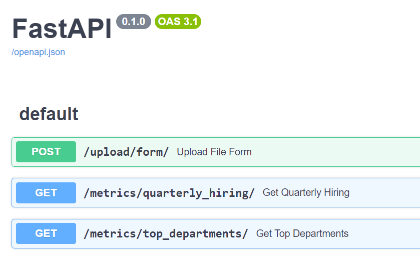

# Globant’s Data Engineering Coding Challenge

This is the project of the API developed for the Globant's Data Engineering Coding Challenge.

## General Information

This project consists of an API developed using the FastAPI framework for Python. It provides endpoints for uploading CSV files and querying hiring metrics and top departments.

## Installation

To install the necessary dependencies, follow the steps below:

1. Clone the project repository:

    ```
    git clone https://github.com/your-username/your-project.git
    ```

2. Navigate to the project directory:

    ```
    cd your-project
    ```

3. Create a virtual environment:

    ```
    python -m venv venv
    ```

4. Activate the virtual environment:

    - On Windows:

        ```
        venv\Scripts\activate
        ```

    - On Unix or MacOS:

        ```
        source venv/bin/activate
        ```

5. Install dependencies using the `requirements.txt` file:

    ```
    pip install -r requirements.txt
    ```

6. Execute the `createdb.py` script to create the SQLite3 database (`database.db`):

    ```
    python database/createdb.py
    ```

    This will create the SQLite3 database using the SQL definition queries contained in the `sql/` directory.

7. Run the FastAPI server using uvicorn:

    ```
    uvicorn api.main:app --reload
    ```

   This will start the FastAPI server, and you can access the API at `http://127.0.0.1:8000/`.

## Endpoints

To interact with the endpoints, please access `http://127.0.0.1:8000/docs/`.



### .CSV File Upload

- **URL:** `/upload/form/`
- **HTTP Method:** `POST`
- **Description:** Endpoint for uploading a CSV file containing data of employees, departments, or jobs. The processing is done in batches, with each batch containing between 1 and 1000 lines.

Click on **Try it out** and choose one of the three possible datasets found in [data/](data/) and a batch size to load the data.


### Quarterly Hiring Metrics

- **URL:** `/metrics/quarterly_hiring/`
- **HTTP Method:** `GET`
- **Description:** Returns the number of employees hired for each job and department in 2021, divided by quarter.
  
#### Response example
```json
[
  {
    "department": "Accounting",
    "job": "Account Representative IV",
    "Q1": 1,
    "Q2": 0,
    "Q3": 0,
    "Q4": 0
  },
  {
    "department": "Accounting",
    "job": "Actuary",
    "Q1": 0,
    "Q2": 1,
    "Q3": 0,
    "Q4": 0
  },
  {
    "department": "Accounting",
    "job": "Analyst Programmer",
    "Q1": 0,
    "Q2": 0,
    "Q3": 1,
    "Q4": 0
  }
]
```


### Top Departments

- **URL:** `/metrics/top_departments/`
- **HTTP Method:** `GET`
- **Description:** Returns a list of departments that hired more employees than the mean of employees hired in 2021 for all the departments, ordered by the number of employees hired (descending).

#### Response example

```json
[
  {
    "id": 8,
    "department": "Support",
    "hired": 221
  },
  {
    "id": 5,
    "department": "Engineering",
    "hired": 208
  },
  {
    "id": 6,
    "department": "Human Resources",
    "hired": 204
  },
  {
    "id": 7,
    "department": "Services",
    "hired": 204
  },
  {
    "id": 4,
    "department": "Business Development",
    "hired": 187
  },
  {
    "id": 3,
    "department": "Research and Development",
    "hired": 151
  },
  {
    "id": 9,
    "department": "Marketing",
    "hired": 143
  }
]
```
